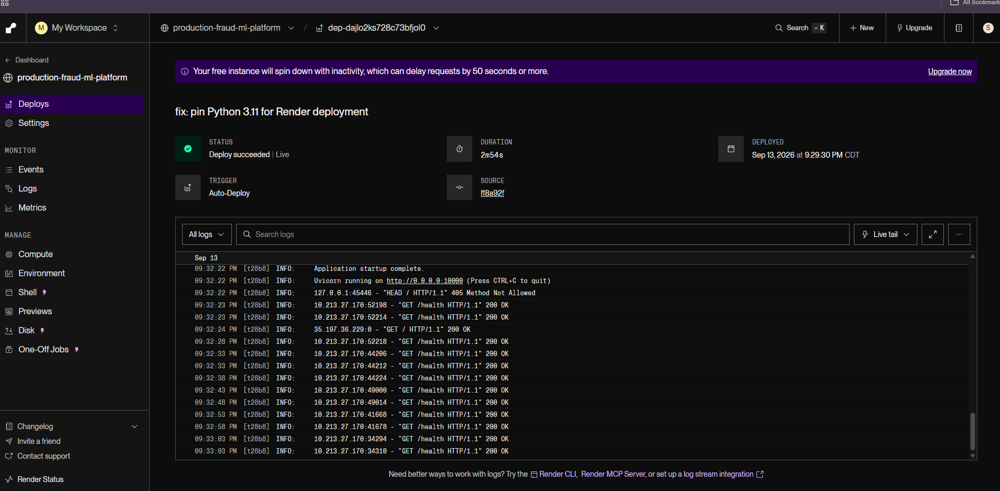
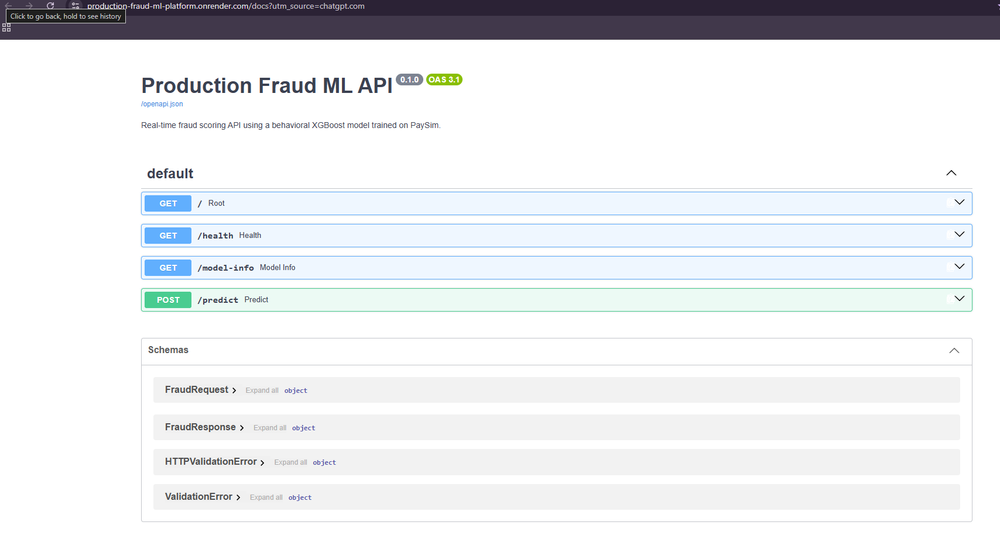
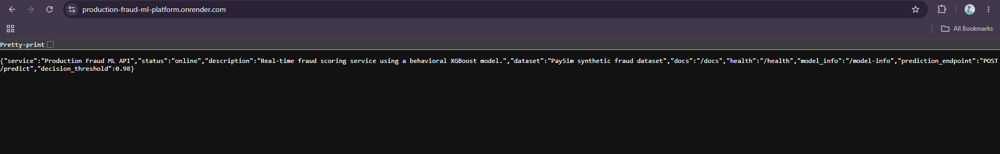
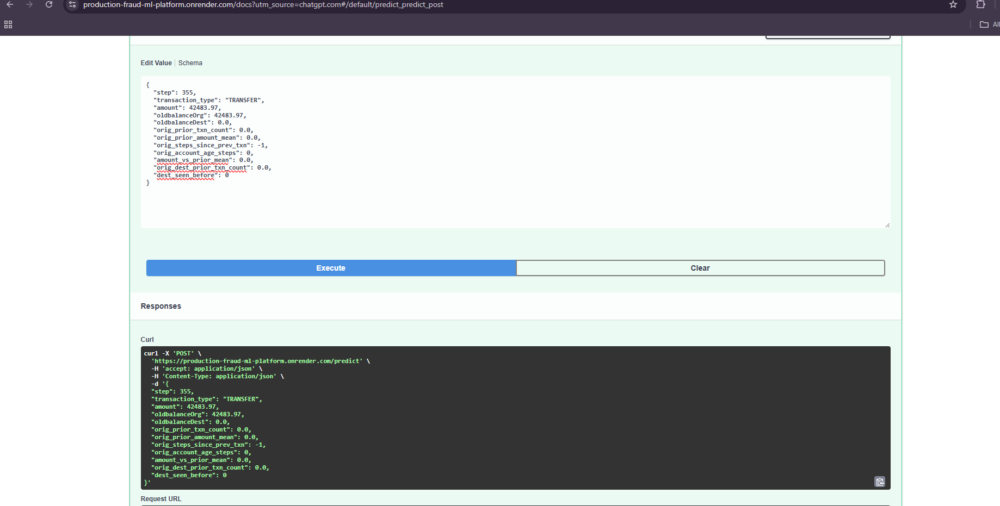
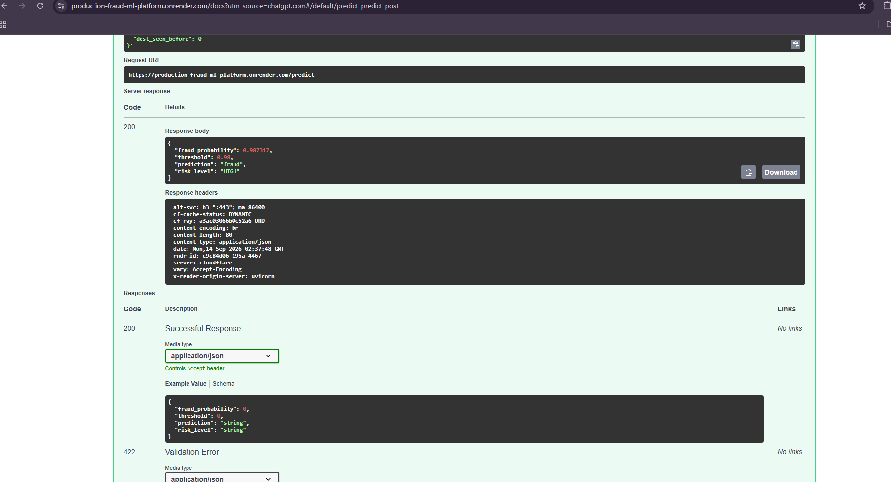

# Production Fraud ML Platform — Working Evidence

This document contains reproducible evidence that the fraud ML platform is trained, tested, deployed, and performing live public inference.

## 1. Automated Test Suite

Latest verified test run:

```text
21 passed, 1 warning
```

The warning is a non-blocking Starlette/TestClient deprecation warning.

## 2. Public Cloud Deployment

Live Service: https://production-fraud-ml-platform.onrender.com

Interactive API: https://production-fraud-ml-platform.onrender.com/docs



## 3. Interactive API Documentation

The deployed FastAPI service exposes:

- `GET /`
- `GET /health`
- `GET /model-info`
- `POST /predict`



## 4. Public Service Verification



## 5. Public Fraud Prediction Request

```json
{
  "step": 355,
  "transaction_type": "TRANSFER",
  "amount": 42483.97,
  "oldbalanceOrg": 42483.97,
  "oldbalanceDest": 0.0,
  "orig_prior_txn_count": 0.0,
  "orig_prior_amount_mean": 0.0,
  "orig_steps_since_prev_txn": -1,
  "orig_account_age_steps": 0,
  "amount_vs_prior_mean": 0.0,
  "orig_dest_prior_txn_count": 0.0,
  "dest_seen_before": 0
}
```



## 6. Public Model Prediction Result

```json
{
  "fraud_probability": 0.987317,
  "threshold": 0.98,
  "prediction": "fraud",
  "risk_level": "HIGH"
}
```



## 7. Verified Model Performance

| Metric | Behavioral Model |
|---|---:|
| ROC-AUC | 0.999906 |
| PR-AUC | 0.974028 |
| Precision @ 0.50 | 0.770368 |
| Recall @ 0.50 | 0.979333 |
| F1 @ 0.50 | 0.862372 |

### Deployed threshold 0.98

| Metric | Value |
|---|---:|
| Precision | 0.929336 |
| Recall | 0.877172 |
| F1 | 0.902501 |

## 8. Data and Leakage Controls

PaySim contains 6,362,620 synthetic transactions, including 8,213 fraud cases.

Production modeling uses:

- strict chronological splitting
- point-in-time behavioral history
- no train/test time overlap
- exclusion of `isFlaggedFraud`
- separation of leakage-prone benchmark results from production results

## 9. Current Architecture

```text
PaySim
  ↓
Validation
  ↓
Temporal Split
  ↓
Behavioral Features
  ↓
DuckDB Feature Store
  ↓
XGBoost
  ↓
Threshold Optimization
  ↓
FastAPI
  ↓
Render
  ↓
Public HTTPS Inference
```

## 10. Current Limitations

The platform now includes a recruiter-facing dashboard, automated CI, public deployment, model/data drift monitoring, and drift-triggered model lifecycle orchestration.

Current limitations and future work include:

- no formal model registry or controlled promotion workflow yet
- stronger online behavioral feature serving
- graph-based fraud detection
- production authentication and authorization
- persistent production monitoring infrastructure
- automated rollback and model-version governance

---

## 11. Verified Model and Data Drift Monitoring

The deployed platform now exposes model and data monitoring through the public dashboard and `/drift` API endpoint.

Verified chronological monitoring windows:

- Reference window: `step < 355`
- Current window: `step >= 355`
- Reference rows: 5,069,097
- Current rows: 1,293,523

Verified monitoring results:

- Overall drift severity: `HIGH`
- Model-score PSI: `0.755221`
- Fraud-rate shift: `4.2191x`
- Reference fraud rate: `0.0780%`
- Current fraud rate: `0.3292%`
- Step PSI: `12.365809`
- Day PSI: `11.799554`

Held-out current-window model performance:

- PR-AUC: `0.974028`
- ROC-AUC: `0.999906`
- Precision at threshold 0.98: `0.929336`
- Recall at threshold 0.98: `0.877172`
- F1 at threshold 0.98: `0.902501`

The monitoring layer intentionally separates distribution drift from model-performance evaluation. High drift therefore does not automatically imply model failure.

Public demo:

`https://production-fraud-ml-platform.onrender.com`

Public drift endpoint:

`https://production-fraud-ml-platform.onrender.com/drift`


---

## 12. Verified Model Lifecycle and Challenger Governance

The deployed platform now exposes lifecycle state through the public dashboard and `/lifecycle` API endpoint.

Verified lifecycle configuration:

- Retraining recommended: `true`
- Automatic promotion allowed: `false`
- Lifecycle severity: `HIGH`
- Challenger cutoff step: `525`
- Training window: `step < 525`
- Evaluation window: `step >= 525`
- Decision threshold: `0.98`

Champion performance on the shared future evaluation window:

- ROC-AUC: `0.999880`
- PR-AUC: `0.986797`
- Precision: `0.964052`
- Recall: `0.871308`
- F1: `0.915337`
- True negatives: `256827`
- False positives: `77`
- False negatives: `305`
- True positives: `2065`

Challenger performance on the same future evaluation window:

- ROC-AUC: `0.999911`
- PR-AUC: `0.990135`
- Precision: `0.882991`
- Recall: `0.996624`
- F1: `0.936373`
- True negatives: `256591`
- False positives: `313`
- False negatives: `8`
- True positives: `2362`

The challenger improved PR-AUC, recall, F1, and false-negative detection, but it also reduced precision and increased false positives substantially.

The promotion gate therefore returned:

`KEEP_PRODUCTION`

Verified rejection reasons:

- Candidate precision degradation exceeds the allowed limit.
- Candidate false-positive increase exceeds the allowed limit.

This demonstrates that retraining and model promotion are intentionally separated. The platform does not replace the deployed champion solely because a challenger improves recall or PR-AUC.

The production model remained unchanged.

Public lifecycle endpoint:

`https://production-fraud-ml-platform.onrender.com/lifecycle`

Verified deployment commit:

`9e01336` — `feat: strengthen challenger promotion governance`
